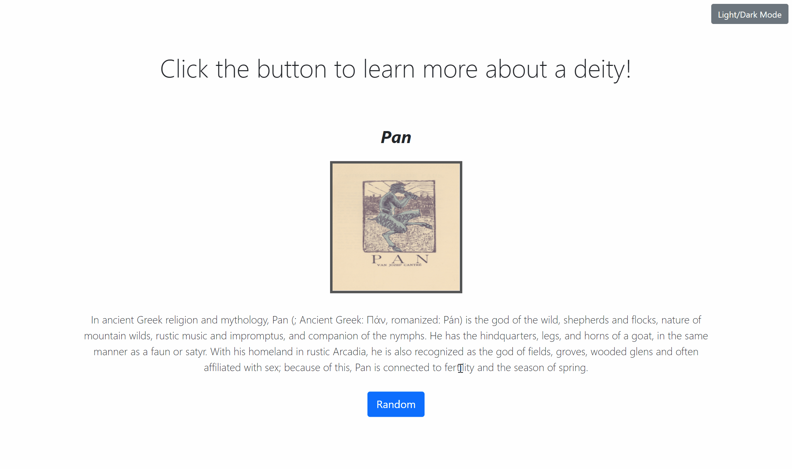

# About
This is a small webapp I developed that allows the user to learn more about a random mythological deity, such as their name, origin, and a small summary about them. Ever since elementary school, I have always had a fascination for mythology and I would love for more people to learn about mythology as well! Through this webapp, I learned how to create and use a database using SQLAlchemy, use that data with Flask and the Wikipedia API to display information to the user, and some Bootstrap/JavaScript to make the page look aesthetically pleasing. I also added a light/dark mode button, as dark mode is gaining a lot of popularity on websites and apps as well as making the site easier to read at night.
# Tech Stack
* Python
* HTML/CSS (Bootstrap)
* JavaScript
* Flask
* SQLALchemy
* Wikipedia API
# Demo

